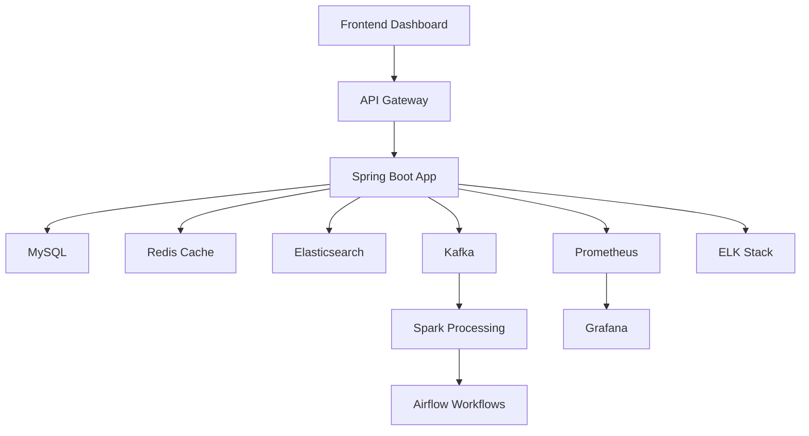

# 🔥 Jibmusil - 개인화 뉴스 큐레이션 및 트렌드 분석 플랫폼

> **면접관을 매료시킬 창의적이고 혁신적인 뉴스 플랫폼** 🚀


## 📖 프로젝트 개요

Jibmusil은 **AI 기반 개인화 뉴스 큐레이션**과 **실시간 트렌드 분석**을 제공하는 차세대 뉴스 플랫폼입니다. 
대용량 분산 시스템과 최신 AI 기술을 활용하여 사용자에게 맞춤형 뉴스 경험을 제공합니다.

## 🌟 핵심 기능

### 🤖 AI 기반 개인화 시스템
- **감정 분석**: GPT-4를 활용한 뉴스 감정 분석
- **개인화 추천**: 협업 필터링 + 콘텐츠 기반 하이브리드 추천
- **실시간 학습**: 사용자 행동 패턴 실시간 분석 및 학습

### 📊 실시간 트렌드 분석
- **키워드 트렌딩**: 실시간 키워드 인기도 추적
- **감정 트렌드**: 시간대별 뉴스 감정 변화 분석
- **소셜 버즈**: 소셜 미디어 반응도 통합 분석

### 🔍 고도화된 검색 시스템
- **Elasticsearch**: 빠르고 정확한 의미론적 검색
- **자동완성**: 실시간 검색어 자동완성
- **패싯 검색**: 다차원 필터링 검색

### 📧 스마트 알림 시스템
- **맞춤형 뉴스레터**: AI가 선별한 개인화 뉴스
- **속보 알림**: 중요도 기반 실시간 속보
- **트렌드 리포트**: 주간/월간 트렌드 분석 리포트

### 📈 실시간 대시보드
- **인터랙티브 차트**: Chart.js 기반 동적 시각화
- **KPI 모니터링**: 실시간 지표 추적
- **사용자 행동 분석**: 참여도 및 만족도 분석

## 🏗️ 시스템 아키텍처



## 🛠️ 기술 스택

### Backend
- **Framework**: Spring Boot 3.5.4 (Java 21)
- **Database**: MySQL 8.0 (Primary), Redis (Cache)
- **Search Engine**: Elasticsearch 8.11
- **Message Queue**: Apache Kafka
- **AI Integration**: Spring AI + OpenAI GPT-4

### DevOps & Infrastructure
- **Containerization**: Docker + Docker Compose
- **Orchestration**: Kubernetes
- **Monitoring**: Prometheus + Grafana
- **Logging**: ELK Stack (Elasticsearch, Logstash, Kibana)
- **Workflow**: Apache Airflow

### Big Data & Analytics
- **Processing**: Apache Spark
- **Data Warehouse**: Hadoop HDFS
- **Real-time Analytics**: Kafka Streams

### Frontend
- **Dashboard**: HTML5 + Chart.js
- **API Documentation**: Swagger/OpenAPI 3.0

## 🚀 빠른 시작

### 필수 요구사항
- Java 21+
- Docker & Docker Compose
- 8GB+ RAM 권장

### 1. 프로젝트 클론
```bash
git clone https://github.com/yourusername/jibmusil.git
cd jibmusil
```

### 2. 환경 설정
```bash
# 환경 변수 설정 (선택사항)
export NEWSAPI_KEY=your_newsapi_key
export OPENAI_API_KEY=your_openai_key
```

### 3. 원클릭 실행
```bash
chmod +x run.sh
./run.sh
```

### 4. 서비스 접속
- **메인 애플리케이션**: http://localhost:8080
- **대시보드**: http://localhost:8080/dashboard.html
- **API 문서**: http://localhost:8080/swagger-ui.html
- **Grafana**: http://localhost:3000 (admin/admin)
- **Kibana**: http://localhost:5601

## 📊 주요 API 엔드포인트

### 뉴스 API
```bash
# 개인화 추천 뉴스
GET /api/personalized/recommendations

# 트렌딩 뉴스
GET /api/personalized/trending

# 감정별 뉴스 필터링
GET /api/personalized/by-sentiment?sentiment=positive

# 뉴스 검색
GET /api/news/search?q=AI&category=technology
```

### 분석 API
```bash
# 대시보드 통계
GET /api/analytics/dashboard

# 트렌드 분석
GET /api/analytics/trends

# 사용자 참여도
GET /api/analytics/user-engagement

# 감정 분석 결과
GET /api/analytics/sentiment-analysis
```

### 이메일 구독 API
```bash
# 구독 설정
POST /api/email/subscribe

# 구독 해지
POST /api/email/unsubscribe

# 구독 목록 조회
GET /api/email/subscriptions
```

## 🎯 면접 어필 포인트

### 1. **실무 중심 아키텍처**
- 마이크로서비스 아키텍처 패턴
- 대용량 트래픽 처리 설계
- 확장성과 가용성 고려

### 2. **최신 기술 스택 활용**
- Spring Boot 3.x + Java 21 (최신 LTS)
- 컨테이너 기반 배포 (Docker/Kubernetes)
- AI/ML 통합 (Spring AI + GPT-4)

### 3. **데이터 처리 및 분석**
- 실시간 스트림 처리 (Kafka + Spark)
- 빅데이터 파이프라인 (Airflow)
- 검색 엔진 최적화 (Elasticsearch)

### 4. **모니터링 및 운영**
- 종합적인 모니터링 시스템
- 로그 중앙 집중화
- 성능 지표 실시간 추적

### 5. **사용자 경험 최적화**
- 개인화 알고리즘 구현
- 실시간 상호작용 처리
- 직관적인 대시보드

## 📈 성능 최적화

### 캐싱 전략
- **Redis**: 세션, 추천 결과, 인기 뉴스
- **Elasticsearch**: 검색 결과 캐싱
- **Application Level**: 스프링 캐시 추상화

### 데이터베이스 최적화
- **인덱싱**: 주요 쿼리 경로 최적화
- **파티셔닝**: 시간 기반 뉴스 데이터 분할
- **커넥션 풀링**: HikariCP 최적화

### 비동기 처리
- **@Async**: 백그라운드 작업 처리
- **Kafka**: 이벤트 기반 비동기 통신
- **CompletableFuture**: 병렬 처리 최적화

## 🧪 테스트 전략

### 단위 테스트
```bash
./gradlew test
```

### 통합 테스트
```bash
./gradlew integrationTest
```

### 성능 테스트
```bash
# JMeter 테스트 시나리오 실행
jmeter -n -t test-plan.jmx
```

## 📦 배포 가이드

### Local Development
```bash
./run.sh
```

### Docker Compose
```bash
docker-compose up -d
```

### Kubernetes
```bash
kubectl apply -f k8s/
```

## 🔧 설정 및 커스터마이징

### application.yml 주요 설정
```yaml
jibmusil:
  news:
    fetch-interval: 300000  # 5분
    batch-size: 100
  recommendation:
    model-update-interval: 3600000  # 1시간
  email:
    daily-digest-time: "08:00"
```

### 환경 변수
| 변수명 | 설명 | 기본값 |
|--------|------|--------|
| `NEWSAPI_KEY` | News API 키 | - |
| `OPENAI_API_KEY` | OpenAI API 키 | - |
| `SPRING_PROFILES_ACTIVE` | 스프링 프로파일 | local |

## 🤝 기여하기

1. Fork the repository
2. Create a feature branch (`git checkout -b feature/amazing-feature`)
3. Commit your changes (`git commit -m 'Add amazing feature'`)
4. Push to the branch (`git push origin feature/amazing-feature`)
5. Open a Pull Request

## 📝 라이선스

이 프로젝트는 MIT 라이선스 하에 배포됩니다. 자세한 내용은 [LICENSE](LICENSE) 파일을 참조하세요.

## 👨‍💻 개발자

**임재억** - *Full Stack Developer*
- GitHub: [@jaeeoklim](https://github.com/jaeeoklim)
- Email: jaeeoklim@example.com

## 🙏 감사의 말

이 프로젝트는 다음 오픈소스 프로젝트들의 도움을 받았습니다:
- Spring Framework Team
- Apache Software Foundation
- Elastic N.V.
- The Chart.js Team

---

⭐ **이 프로젝트가 도움이 되었다면 스타를 눌러주세요!** ⭐